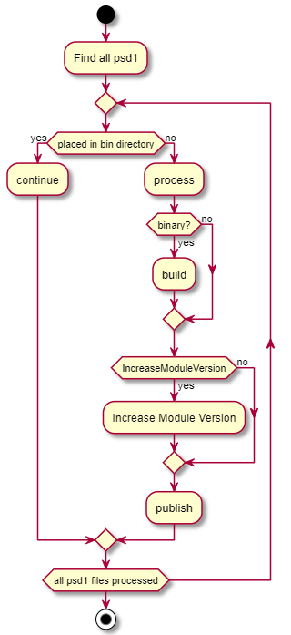

<!--Category:Powershell--> 
 <p align="right">
    <a href="https://www.powershellgallery.com/packages/ProductivityTools.PSPublishModuleTo/"></a>
    <a href="http://productivitytools.tech/publish-moduleto/"><a> 
    <a href="https://github.com/pwujczyk/ProductivityTools.PSPublishModuleTo"></a>
</p>
<p align="center">
    <a href="http://productivitytools.tech/">
        
    </a>
</p>

# Publish-ModuleTo


Publishing module to PowerShell gallery is very straight-forward task. To do it we just need to invoke command

```powershell
Publish-Module -NuGetApiKey $nuGetApiKey -Name $fullPath
```

If we are pushing to different repository than default. We also can provide PSRepository  parameter.

```powershell
Publish-Module -PSRepository $psRepository -NuGetApiKey $nuGetApiKey -Name $fullPath
```

As I am publishing a lot I am trying to automate this repeatable task. This module allows to be invoked in the directory of the module without pointing out exact psd1 file. Cmdlet will find it and process.

If module is binary one it will rebuild application and publish the newest version.

Also it allows to use **UpdateModuleVersion** switch, which will increase patch number (z in  X.Y.Z).

This module is base for other, more specific ones. Please check out [Publish-ModuleToPowershellGallery](https://github.com/pwujczyk/ProductivityTools.PublishModuleToPowershellGallery)

## Examples 

Go to the directory of the module and invoke
```powershell
Publish-ModuleTo -PSRepository PSGallery -PSRepositoryApiKey PSGalleryApiKey -Verbose
```

## Switches
- IncreaseModuleVersion - it will increase patch number in the target module

## Diagram

